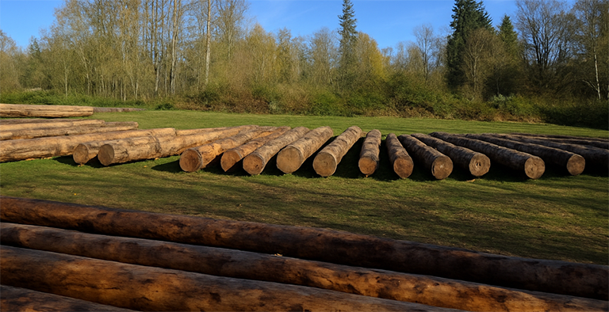
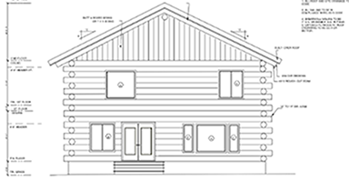
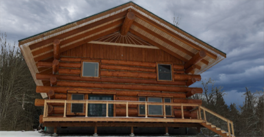

<!-- Copyright 2015-2026 Maria Mercury <mariak>. All Rights Reserved. -->

# Log Stacking

A command-line Python application that suggests the optimal stacking order
for building a log house shell using the [butt and pass](https://www.theoutdoorhacker.com/the-butt-and-pass-log-cabin-method-expert-explain/#What_is_the_Butt_and_Pass_Technique) method.

## Background

This program was originally written in 2015 and used as a guideline for log selection in an actual
log house build conducted from raw peeled logs, graded for structural construction. The algorithm was used on-site to determine the stacking order for the walls.

The project was recently modernized and published on GitHub as a
showcase of the original work.




## Overview

Given a log catalogue (CSV file) and target structure dimensions, the program selects and arranges logs into layers to form four walls of a square log house.The algorithm optimizes log placement to keep walls level and minimize corner gaps, using a greedy search with exhaustive combination testing.

For each layer, the program prints which logs were selected, their orientation (which end faces which cardinal direction), the corner heights contributed by that layer, and the cumulative wall heights at all four corners — giving the builder a precise, actionable stacking order to follow on site.

For reflections and brief insights about the actual build journey, visit the
[build log](https://medianpath.blogspot.com).

## What is "Butt and Pass"?

In butt and pass log construction:

- Each log runs the full length of one wall and overlaps the perpendicular wall at the corner
- The **butt** end of one log sits at the corner
- The **pass** end of the adjacent log crosses over it with an **overdangle**
- Logs alternate direction each course (layer)
- The taper of each log affects the height at each corner

## Real-World Validation

The algorithm was validated against an actual log catalogue from the original 2015 build. Using a catalogue of real peeled logs, the program successfully proposed a stacking order for a 34 x 34 ft and 16 ft tall structure, completing the wall shell in 10 layers within 1.8 inches of the target
height.

### Command used

```bash
python -m loghouse --logfile data/realistic_catalogue.csv --length 34 --height 16
```

### Final layer and summary (output snippet)

```LAYER #10
------------------------------------------------------------
SW: LOG# 47    FAT_END    overdangle=7.17  corner=19.50
NW: LOG# 32    THIN_END   overdangle=7.30  corner=15.50
NE: LOG# 18    FAT_END    overdangle=6.80  corner=19.50
SE: LOG# 56    THIN_END   overdangle=6.83  corner=15.92

Corner heights:
  SW: 19.50  NW: 15.50  NE: 19.50  SE: 15.92

Cumulative heights:
  SW: 187.45  NW: 190.21  NE: 186.77  SE: 186.32

Logs remaining: 7

------------------------------------------------------------
SUMMARY
------------------------------------------------------------
Total layers:        10
Target height:       16 ft 0.0 in
Actual height:       15 ft 10.2 in (max of 4 corners)
Height margin:       1.8 in
Level (std dev):     1.51 in
Status:              WARNING: not level
------------------------------------------------------------
```

The `WARNING: not level` status reflects a standard deviation of 1.51 inches across the 4 corners — within the default 2.0 inch level margin and well within acceptable tolerances for log house construction. The 7 remaining logs were not wasted — they were milled into structural lumber and used for the interior staircase and other structural elements of the house.

## Project Structure

```text
log_stacking/
    loghouse/            # Python package
        config.py            # Constants and enumerations
        models.py            # Log, LogEntry, Layer classes
        catalogue.py         # CSV reading and log type definitions
        selector.py          # Log selection functions
        builder.py           # Layer building algorithm
        printer.py           # Output formatting
        cli.py               # Command line interface
        utils.py             # Shared utility functions
    tests/               # Test suite
    data/                # Sample catalogues
    README.md
    requirements.txt
    requirements-dev.txt
    .gitignore
    .pylintrc
    .style.yapf
    pyproject.toml
```

## Installation

```bash
# Clone the repository
git clone https://github.com/yourusername/log_stacking.git
cd log_stacking

# Create and activate virtual environment
python -m venv .venv
source .venv/Scripts/activate  # Windows Git Bash
# or
source .venv/bin/activate       # Linux/Mac

# Install dependencies
pip install -r requirements.txt
```

## Usage

```bash
python -m loghouse --logfile data/catalogue.csv --length 33 --height 15.0
```

### Parameters

| Parameter | Description | Default |
|-----------|-------------|---------|
| `--logfile` | Path to log catalogue CSV file | required |
| `--length` | Structure side length in feet | 33.0 ft |
| `--height` | Target structure height in feet | 15.0 ft |
| `--level-margin` | Max allowed corner height difference in inches | 2.0 in |
| `--taper-margin` | Max taper difference for candidate selection in inches/ft | 0.1 |
| `--height-tolerance` | Maximum allowed height overshoot in inches | 10.0 in |
| `--output` | Output filename (default: stdout) | stdout |
| `--no-catalogue` | Skip printing the log catalogue | False |
| `--verbose` | Enable debug logging | False |

### Example

```bash
# Basic usage
python -m loghouse --logfile data/catalogue.csv --length 33 --height 15.0

# Save output to file, skip catalogue
python -m loghouse \
  --logfile data/catalogue.csv \
  --length 33 \
  --height 15.0 \
  --no-catalogue \
  --output stacking_order.txt

# Verbose debug output
python -m loghouse \
  --logfile data/catalogue.csv \
  --length 33 \
  --height 15.0 \
  --verbose
```

## Log Catalogue Format

The catalogue is a CSV file with the following columns:

| Column | Type | Required | Description |
|--------|------|----------|-------------|
| `index` | int | yes | Unique log identifier (user assigned) |
| `d_top` | float | yes | Narrow end diameter in inches |
| `d_butt` | float | yes | Wide end diameter in inches |
| `length` | float | yes | Log length in feet |
| `notes` | string | no | Description (e.g. "straight", "bowed", "crooked") |
| `log_type` | string | no | Log type (see below), defaults to WALL |

### Log Types

| Type | Count | Description |
|------|-------|-------------|
| `WALL` | all remaining | Standard stacking logs |
| `RPSL` | 3 | Ridge Pole Support Logs |
| `GSL` | 1 | Girder Support Log |
| `GIRDER` | 1 | 2nd floor support log |
| `CAP` | 2 | Top layer logs (~20% longer than WALL) |
| `RP` | 1 | Ridge Pole (largest/longest, never stacked in a wall shell) |

A log can have at most four types, separated by `|` (e.g. `WALL|RPSL|GIRDER`).

### Sample Catalogue

```csv
index,d_top,d_butt,length,notes,log_type
0,14.0,18.0,35.0,straight,WALL
1,14.5,18.5,36.0,slightly curved,WALL
2,15.0,19.0,35.5,,WALL|RPSL
3,15.5,19.5,36.0,,CAP
4,16.0,22.0,40.0,largest log,RP
```

## Algorithm

### Layer Building

1. **First layer** — tries both THIN and FAT end first, picks the one
   with the smallest corner connection distance
2. **Even layers** — tries all `C(n,4)` combinations of candidates,
   picks the combination with minimum standard deviation of cumulative
   corner heights (enforces leveling)
3. **Odd layers** — tries all `C(n,4)` combinations, picks minimum
   corner connection distance

### Candidate Selection

For each layer, candidate logs are filtered from remaining logs by
matching their taper rate to the previous layer's wall tapers within
a configurable margin (`--taper-margin`). If fewer than 4 candidates
are found, a fallback selects logs with the largest average diameter
and closest taper match.

### Stopping Conditions

- ✅ **Success** — target height reached and corners are level
- ⚠️ **Height exceeded** — actual height more than 6 inches above target
- ⚠️ **Not enough logs** — ran out of logs before reaching target height
- ⚠️ **Not level** — corners exceed level margin at final layer

## Output

```text
| WALL LOGS CATALOGUE (SORTED BY THIN ENDS)               |
| Num       Top (in)    Butt (in)   Length (ft) Taper (in)|
| LOG# 0       14.00       18.00       35.00     0.114    |
...

LAYER #1
SW: LOG# 5  FAT_END    overdangle=2.00  corner=16.23
NW: LOG# 12 THIN_END   overdangle=1.50  corner=15.87
NE: LOG# 3  FAT_END    overdangle=2.10  corner=16.45
SE: LOG# 8  THIN_END   overdangle=1.80  corner=16.12
Corner heights:
SW: 16.23  NW: 15.87  NE: 16.45  SE: 16.12
Cumulative heights:
SW: 16.23  NW: 15.87  NE: 16.45  SE: 16.12
Logs remaining: 44
...

SUMMARY
Total layers:        12
Target height:       15 ft 0.0 in
Actual height:       15 ft 1.2 in  (max of 4 corners)
Height margin:       1.2 in
Level (std dev):     0.45 in
Status:              OK
```

## Development

### Running Tests

```bash
pytest -v
```

### Running Lint

```bash
pylint loghouse/ tests/
```

### Code Style

This project follows the
[Google Python Style Guide](https://google.github.io/styleguide/pyguide.html)
with 2-space indentation and 80 character line limit.

## Known Limitations and Future Work

- Only WALL logs are currently used for stacking. Selection of RPSL,
  GSL, GIRDER, CAP and RP logs is not implemented.
  (`TODO(mariak)`)
- Multi type logs (e.g. `WALL|RPSL`) are not considered for stacking at the moment; don't mark it in the catalogue - to make all potential wall logs be evaluated.
  (`TODO(mariak)`)
- A lookahead algorithm is planned as an alternative to the current
  greedy approach for better global optimization. (`TODO(mariak)`)

## License

Copyright 2015-2026 Maria Mercury <mariak>. All Rights Reserved.
